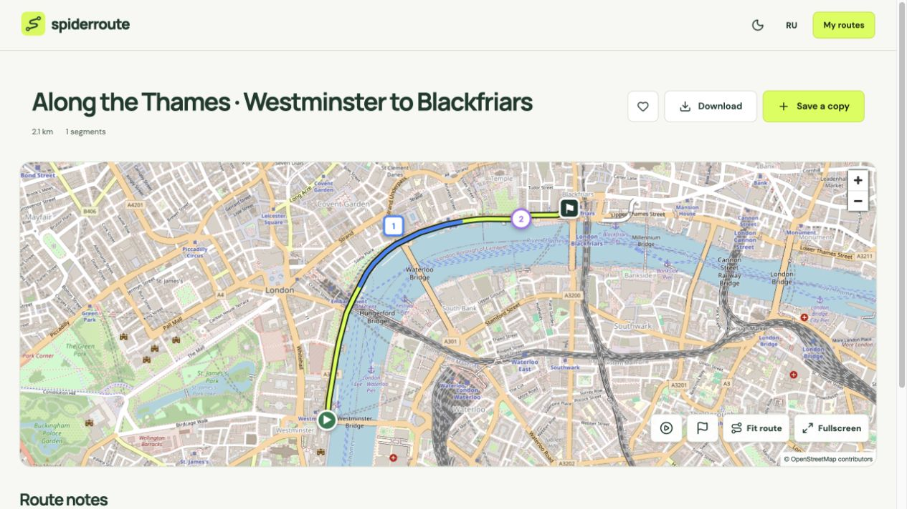

# SpiderRoute

Keep the rides you want to do again, and make them easy to share. SpiderRoute helps you turn a GPS recording into a route a friend can follow: tidy up the track, mark a good stop or a stretch worth remembering, and send a map they can open on their phone without signing in.

Bring a route from your cycling app or GPS device, or draw one yourself. Add a ride video to connect places on the map with moments in the footage. Your routes stay in your own library until you choose to share them.

[Open SpiderRoute](https://app.spiderroute.com/) · [Visit the website](https://spiderroute.com/) · [Русская версия](https://ru.spiderroute.com/)



*The real app in English, captured without browser controls. The sample route follows the Thames in London; its notes are illustrative. Map data © [OpenStreetMap contributors](https://www.openstreetmap.org/copyright).*

## What you can do

- **Bring your rides together.** Import GPX, KML, GeoJSON or CSV. Sort your routes and favorites by date, distance or name, or view several routes together on one map.
- **Make a track easier to follow.** Draw a route, move or insert points, edit sections, and undo changes. Set the start and finish where you want them and jump to either end of the map.
- **Remember more than the line.** Add colored notes to points or whole stretches of a route. Mark a meeting place, a photo stop or a section you want to revisit. Click a note to zoom to that place.
- **Connect the ride to its video.** Attach a YouTube video and link notes to a timestamp or time range. Click a linked point or section to seek to it; let the map follow the relevant places during playback. You can also show the channel’s subscription widget.
- **Share a route friends can open.** Preview the map, choose how much to hide around the start and finish, and copy a link. Shared pages show the route, notes and any attached video without requiring an account. Links support English and Russian.
- **Keep a route for later.** Favorite a shared route or save an independent copy to your library. Download a track in GPX, KML, GeoJSON or CSV for use elsewhere.
- **Use the app your way.** Choose English or Russian and light or dark mode. Account settings remember your preferences. Titles save when you leave the field, and route edits save automatically.

For example, take a weekend ride you recorded, clean up a misplaced point, mark where you stopped for a photo, and attach the video of that stretch. Your friend can explore those places on the shared map and download the track for their own ride.

## A few things to know

- Hiding the start and finish reduces what you reveal, but does not guarantee anonymity. Check the preview and the text of your notes before sharing.
- Removing a share link prevents future access through that link. It cannot recall files someone downloaded or copies they already saved.
- Routes and notes are user supplied. Check access, conditions and suitability before riding; the app does not verify that a route is safe or legal for your vehicle.
- Uploads support up to 25 MB and 200,000 points. Maps and embedded videos need an internet connection; offline maps are not included.

## For contributors and self-hosters

The source is available here for you to inspect and run yourself. The operational details live in these guides:

- [Security and privacy](docs/security.md) — ownership, public snapshots, link revocation and upload safeguards.
- [Deployment and backups](docs/deployment.md) — Coolify, domains, persistent storage, health checks and recovery.
- [Email with Postal](docs/email.md) — sender setup, delivery, signed webhooks and bounced recipients.
- [Map hosting](docs/maps.md) — OpenStreetMap attribution and switching to your own tile server.
- [Development and checks](docs/development.md) — the stack, tests and safe test data.
- [Landing-page SEO](docs/landing-seo.md) — language-specific landing pages and search metadata.

## License

Copyright 2026 Igor Shadurin. SpiderRoute’s original source code is licensed under the [Apache License 2.0](LICENSE).

Third-party dependencies and assets retain their respective licenses. OpenStreetMap data and derived route geometry remain under ODbL; see the [map asset attribution](public/maps/README.md).

## Run locally

Use Node.js 24. From a checkout of this repository:

```sh
npm ci
cp .env.example .env.local
```

Set `NEXTAUTH_SECRET` in `.env.local` to a random value. Generate one with:

```sh
node -e "console.log(require('node:crypto').randomBytes(32).toString('hex'))"
```

Then start the app:

```sh
npm run dev
```

Open [the local workspace](http://localhost:3210/workspace). The local landing page is at [localhost:3210](http://localhost:3210/); add `?lang=ru` to preview it in Russian. On the hosted app, the workspace lives at [app.spiderroute.com](https://app.spiderroute.com/).

For a local test account:

```sh
npm run demo:create -- email@example.test 'Explorer'
```

The command prints a generated password once. Keep it private, then open **Demo access** on the sign-in page. Public email/password registration is not available; OAuth buttons appear when their provider credentials are configured. See [development checks](docs/development.md) before contributing a change.
